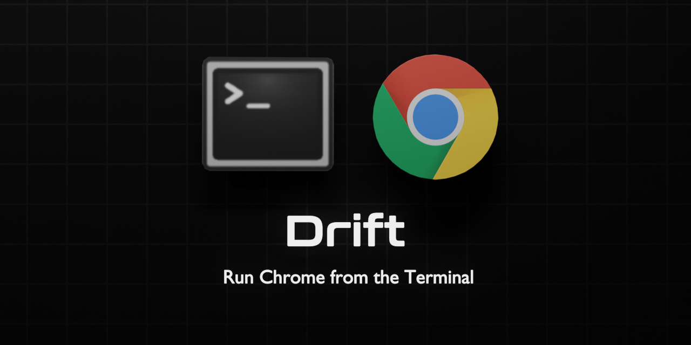

<div align='center'>

<h1>Drift</h1>

<p>Run Chrome from the Terminal</p>

</img>

[](https://badge.fury.io/js/%40sinclair%2Fdrift)

</div>

## Install

```bash
$ npm install -g @sinclair/drift 
```

## Example

```bash
$ drift run index.ts                            # run index.ts

$ drift url http://localhost:5000               # load localhost:5000

$ drift url http://localhost:5000 run index.ts  # load localhost:5000 then run index.ts
```

## Overview

Drift is a command line tool to run Chrome from the terminal. It is built upon the Chrome DevTools Protocol (CDP) and enables one to automate and run code within Chrome using a similar command line interface to Node. Drift integrates the DevTools Console directly into the terminal and redirects browser logging to stdout. It also implements a repl for interactive scripting.

Drift was written to enable browser software to be built with workflows similar to Node development. It is orientated towards developing non-UI browser functionality (such as WebRTC, IndexedDB) without requiring an open browser window. Drift can be used as a general purpose scripting environment or as an ultra lean alternative to existing browser testing tools.

Built against Chrome 104.0.5112 and Node v18.4.0

License MIT

## Contents

- [Install](#install)
- [Commands](#commands)
- [Examples](#examples)
- [Testing](#testing)

## Commands

Drift accepts commands for its arguments. Each command is run in sequence. When all commands have run; Drift will enter an interactive repl mode similar to the Chrome Console. You can pass an zero or more commands to run. To have Drift exit once each command is completed, ensure the last command is `close`.

```bash
$ drift [...command]
```

The following commands are supported

```typescript
┌────────────────────────┬─────────────────────────────────────────────────────────────────┐
│ Command                │ Description                                                     │
│                        │                                                                 │
├────────────────────────┼─────────────────────────────────────────────────────────────────┤
│ run <path>             │ Run script on the current page                                  │
│                        │                                                                 │
├────────────────────────┼─────────────────────────────────────────────────────────────────┤
│ url <url>              │ Sets the current page to the given url                          │
│                        │                                                                 │
├────────────────────────┼─────────────────────────────────────────────────────────────────┤
│ window                 │ Run with a chrome window                                        │
│                        │                                                                 │
├────────────────────────┼─────────────────────────────────────────────────────────────────┤
│ size <w> <h>           │ Sets the window size                                            │
│                        │                                                                 │
├────────────────────────┼─────────────────────────────────────────────────────────────────┤
│ pos <x> <y>            │ Sets the window position                                        │
│                        │                                                                 │
├────────────────────────┼─────────────────────────────────────────────────────────────────┤
│ click <x> <y>          │ Emit mousedown event to the current page                        │
│                        │                                                                 │
├────────────────────────┼─────────────────────────────────────────────────────────────────┤
│ save <path>            │ Saves screenshot in Png, Jpg or Pdf format                      │
│                        │                                                                 │
├────────────────────────┼─────────────────────────────────────────────────────────────────┤
│ user <path>            │ Sets the user data directory                                    │
│                        │                                                                 │
├────────────────────────┼─────────────────────────────────────────────────────────────────┤
│ wait <ms>              │ Wait for the given milliseconds                                 │
│                        │                                                                 │
├────────────────────────┼─────────────────────────────────────────────────────────────────┤
│ close                  │ Closes the drift process                                        │
│                        │                                                                 │
└────────────────────────┴─────────────────────────────────────────────────────────────────┘
```

## Examples

The following shows a few examples

```bash
# start -> repl

$ drift
```

```bash
# start -> run index.ts -> repl

$ drift index.ts
```

```bash
# start -> open window -> run index.ts -> wait 5 seconds -> close

$ drift window run index.ts wait 5000 close
```

```bash
# start -> load github.com -> wait 4 seconds -> save screenshot -> repl

$ drift nav https://github.com wait 4000 save screenshot.png
```

## Testing

Drift runs code in the browser environment as standard with the exception of `window.close(...)`. Drift patches this function to enable browser scripts to terminate the Drift host process with an optional exit code. This functionality enables browser scripts to take part in automated testing workflows on CI environments.

```typescript
test().then(() => window.close(0)).catch(() => window.close(1))
```

Which can be run on CI environments with the following.

```bash
$ drift run test.ts
```